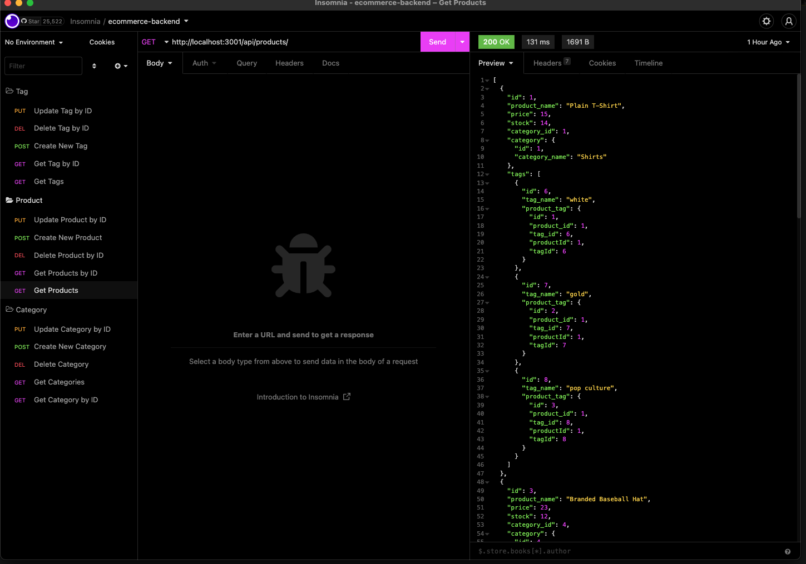

# ecommerce-backend

## Description

This project contains the back-end code for an e-commerce site. By utilizing express.js and Sequelize the user is able to interact with a MySQL database and preform all CRUD operations. Routes have been built that all the user to create new Products, Tags, and Categories; get all and get by IDs the Products, Tags, and Categories; and update or delete by ID the Products, Tags, and Categories.

## Table of Contents

  - [Installation](#installation)
  - [Usage](#usage)
  - [License](#license)
  - [Credit](#credit)
  - [Questions](#questions)

## Installation

The user will need to install node.js with the following dependencies.

## Usage

Video Walk Through:

https://drive.google.com/file/d/19tZT9Rqf-nNUk_XucxniiWVCdNZLrase/view 

## License

This application uses the MIT license.
  
MIT: https://choosealicense.com/licenses/mit/

## Credit

Leon Forsythe, Justin Pauldo, Eric Kim, and Layne Nigro were of great help debugging issues.

## Questions

If you have any questions about the repo, open an issue or 
contact me directly at ryanmbelcher86@gmail.com. You can find more of my work at 
https://github.com/ryanmbelcher.